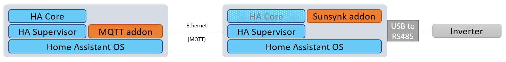
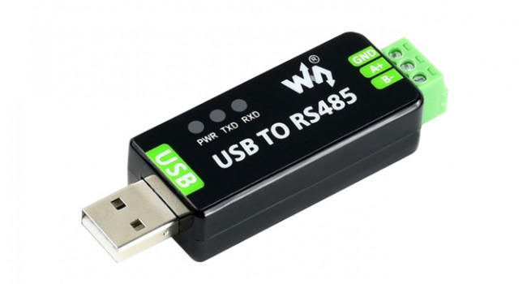
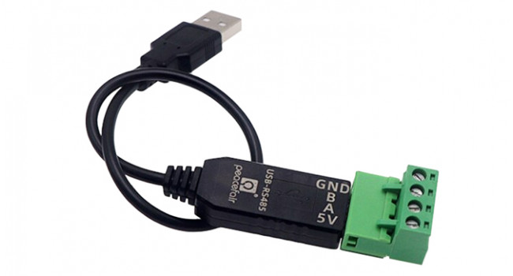
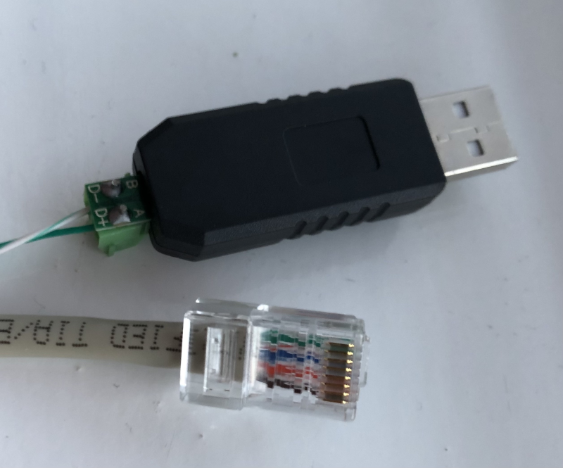
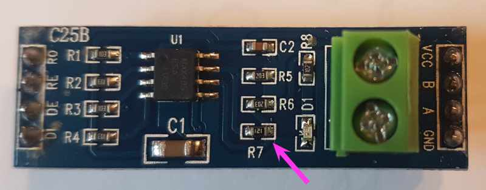

# Sunsynk Inverters

This repo enables access to Sunsynk Hybrid Inverter through a Python 3 library. It also provides an Add-On that can be installed in the Home Assistant OS.

See <https://www.sunsynk.org/> for more information on Sunsynk inverters.

This code was developed on a Sunsynk 5.5 kWh.

> DISCLAIMER: Use at your own risk! Especially when writing any settings.

## Sunsynk Python Library

[](https://codecov.io/gh/kellerza/sunsynk)

The Python library is available through pip:

```bash
pip install sunsynk
```

## Home Assistant Sunsynk Add-On

For the Add-On you require Home Assistant OS and a RS-485 adaptor to connect to your Sunsynk inverter. Sensors are read using the Modbus protocol and sent to a MQTT server.

### Installation

1. Add this repository to your HA Supervisor

   [](https://my.home-assistant.io/redirect/supervisor_add_addon_repository/?repository_url=https%3A%2F%2Fgithub.com%2Fkellerza%2Fsunsynk)

   `https://github.com/kellerza/sunsynk`

2. Install the Sunsynk Add-On from the **Add-On Store** and configure through the UI

   


Below an example of the HomeAssistant Energy management dashboard using sensors from the Sunsynk.


## Deployment options

If the Inverter is close to your server/SBC running Home Assistant, you can use the standard deployment option, else you can extend the RS485 over Ethernet via a gateway or even MQTT

1. Standard

   The Sunsynk Add-on runs on the Home Assistant OS, reads the Inverter's Modbus registers over RS-485, and publishes sensor values to the MQTT server.
   The architecture is shown below:

   

2. A Modbus TCP to RTU/serial gateway

   This can be another Raspberry Pi, even an old one, running the gateway software, like [mbusd](./hass-addon-mbusd/README.md).

   You can also use a commercial Modbus gateway, like the USR-W630

   

3. Extend with an MQTT gateway

   This remote option runs the Sunsynk Addon close to the Inverter, and then sends MQTT messages over your network toward the MQTT server (typically on the same server as Home Assistant)

   


## Connect to your Inverter with RS485
RS485 requires a twisted pair, this works with CAT5 network cable and RJ-45 connectors.

If the RJ-45 connector on the inverter side is crimped according to [T568A](https://en.wikipedia.org/wiki/ANSI/TIA-568#Wiring), you can use the pinout in the following table.

| RJ45 Pin<br>(inverter side) | Wire Color<br>(when using T568A) | RS485<br>pins |
| :-------------------------: | :------------------------------: | :-----------: |
|              1              |           Green-White            |     B/D-      |
|              2              |              Green               |     A/D+      |
|              3              |           Orange-White           |      GND      |

### USB-to-RS485 adaptors

1. Wave USB-to-RS485 [example](https://www.robotics.org.za/W17286)

   This is my preferred adaptor. It includes a GND and lightning/ESD protection, TVS diodes and a resettable fuse.

   Wave also has a RS485-to-Ethernet module. (not tested)

   

1. USB-to-RS485 adaptor with cable [example](https://www.robotics.org.za/index.php?route=product/product&product_id=5947)

   Includes a GND and TVS diode and USB self recovery options.

   

Other tested adaptors
- USB-to-RS485 3 Pin adaptor [example](https://www.robotics.org.za/RS485-3P)

  Includes a GND and TVS diode and USB self recovery options.


- 2-Wire USB-to-RS485 [example](https://www.robotics.org.za/RS485-MINI)

  This is the adaptor I started with. It works, but does not include a GND, so your success might vary.

  

### Wifi-to-RS485 gateways

1. USR-W630 Wifi-to-RS485

   This is a tested Wifi-to-RS485 gateway, which also includes a GND.

   Requires `READ_SENSORS_BATCH_SIZE` set to 8 or less

## Fault finding

If you fail to get a reply from the inverter, please check the following

### (a) Only a single connection to the serial port

Ensure you only have a single addon connected to the serial port. The following can all potentially access the USB port: mbusd, Node RED, the normal and dev addon version.

If you need to have multiple connections to the serial port: ONLY connect mbusd to the serial port. Connect all addons to mbusd (e.g. tcp://192.168.1.x:503 )

### (b) Check the Modbus Server ID

Ensure the Modbus server ID (`MODBUS_SERVER_ID` config setting) setting matches the configured **Modbus SN** value of the inverter

View/update the Modbus server ID on your inverter under "Advanced Settings" / "Multi-Inverter"


### (c) Check line voltage / termination resistor

If your RS485 adapter has a termination resistor (typically 120 ohms), try removing it.

To check, disconnect the adapter and use a multimeter to measure the resistance between A & B.

The d.c. voltage between A/B on the sunsynk RS485 connection should idle around 4-5v with nothing connected,
but this may drop to around 0.5v with the 120 ohm load.

RS485 devices are typically multi-drop with a termination resistor on the first and last devices.
However, the RS485 BMS port may only be intended to connect to a single device.



## Tested Inverters

There are several inverters that are rebranded Deye inverters, so you might have success with other inverter brands as well, please add your inverter by editing this file and creating a Pull Request if you are successful.

| Inverter Model | Battery           | Version  | User          | Port(s)                  |
| -------------- | ----------------- | -------- | ------------- | ------------------------ |
| Sunsynk 3.6kW  | Sunsynk SSLB1     | beta/all | @reedy        | BMS485 (top left)        |
| Sunsynk 5.5kW  | Hubble AM-2       | beta/all | @kellerza     | BMS485 (top left)        |
| Sunsynk 8.8kW  | BSL 8.2 kWH       | 0.0.8    | @dirkackerman | RS485 (1 in image below) |
| Deye  8kW      | Pylontech US3000C | 0.1.3dev | @Kladrie      | RS485 (top left)         |
| Turbo-E   5kW  | DIY with JKBMS    | 0.1.4    | @agtconf      | BMS485 (top left)        |
### Sunsynk 3.6kW Inverter


### Sunsynk 5.5kW Inverter
Tested with: USB-to-RS485 adaptor sourced from Banggood, very similar to [this](https://www.robotics.org.za/RS485-MINI?search=rs485).

NOTE: RJ-45 port marked **RS485** (bottom right) does not work.

### Sunsynk 8.8kW Inverter


Tested with: USB-to-485 adaptor sourced from Micro Robotics, [here](https://www.robotics.org.za/index.php?route=product/product&product_id=5947)

### Deye 8kW Inverter


RS485 is the blue line - top left, as with the Sunsynk inverters. Yellow is the CAN-comms with the Pylontech batteries

### Turbo-Energy 5kW Inverter
Tested with: USB-to-RS485 adaptor sourced from Aliexpress, very similar to [this](https://www.robotics.org.za/RS485-3P).


## Credits

Information in the Power forum was especially helpful to get this up and running, see [this thread](https://powerforum.co.za/topic/8646-my-sunsynk-8kw-data-collection-setup/)

Special Kudos to Bloubul7, @jacauc and Sc00bs.

The original Node-RED flows can be found on @jacauc's repo [here](https://github.com/jacauc/SunSynk-NodeRed)

Sunsynk 8.8kW diagram from system32 in [this thread](https://powerforum.co.za/topic/8451-sunsynk-inverter-monitoring)
