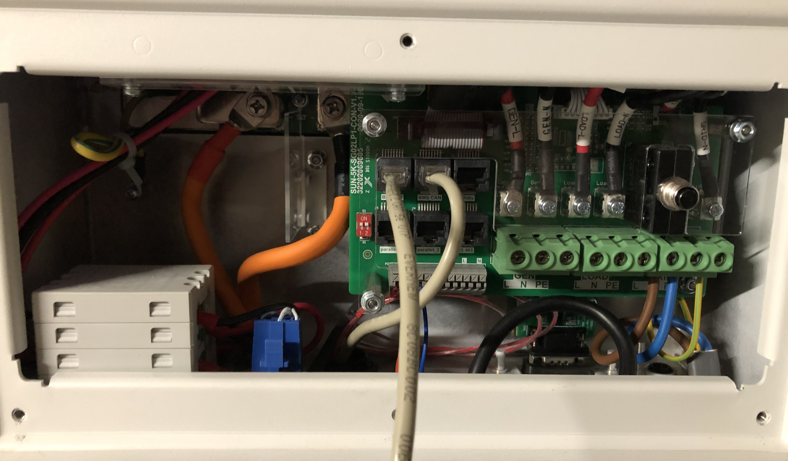

# Sunsynk Inverters

This repo enables access to Sunsynk Hybrid Inverter through a Python 3 library. It also provides an Add-On that can be installed in the Home Assistant OS.

See <https://www.sunsynk.org/> for more information on Sunsynk inverters.

This code was developed on a Sunsynk 5.5 kWh.

> DISCLAIMER: Use at your own risk! Especially when writing any settings.

## Sunsynk Python Library

[](https://codecov.io/gh/kellerza/sunsynk)

The Python library is available through pip:

```bash
pip install sunsynk
```

## Home Assistant Sunsynk Add-On

For the Add-On you require Home Assistant OS and a RS-485 adaptor to connect to your Sunsynk inverter. Sensors are read using the Modbus protocol and sent to a MQTT server. Below an example of the HomeAssistant Energy management dashboard using sensors from the Sunsynk.


### Add-On Installation

1. Add the repository to your HA Supervisor
   <br>[](https://my.home-assistant.io/redirect/supervisor_add_addon_repository/?repository_url=https%3A%2F%2Fgithub.com%2Fkellerza%2Fsunsynk)
   `https://github.com/kellerza/sunsynk` <br><br>
2. Install the Sunsynk Add-On from the **Add-On Store** and configure through the UI

### Add-on Deployment

The Sunsynk Add-on runs on the Home Assistant OS, reads the Inverter's Modbus registers over RS-485, and publishes sensor values to the MQTT server.
The architecture is shown below:


If the Inverter is far from the server/SBC running Home Assistant, you have several ways to extend the deployment:

1. The preferred remote option is to use MQTT over your home network toward the main MQTT server (typically on the same server as Home Assistant)

   

2. Another option is to use a Modbus TCP to RTU/serial gateway. This can be another Raspberry Pi, even an old one, running the gateway software, like [mbusd](./hass-addon-mbusd/README.md).

   You can also use a commercial Modbus gateway, like the USR-W630 (reported via Powerforum)

   

## Tested Inverters

There are several inverters that are rebranded Deye inverters, so you might have success with other inverter brands as well, please add your inverter by editing this file and creating a Pull Request if you are successful.

| Inverter Model | Battery           | Version  | User          | Port(s)                    |
| -------------- | ----------------- | -------- | ------------- | -------------------------- |
| Sunsynk 3.6kW  | Sunsynk SSLB1     | beta/all | @reedy        | BMS485 (top left)          |
| Sunsynk 5.5kW  | Hubble AM-2       | beta/all | @kellerza     | BMS485 (top left)          |
| Sunsynk 8.8kW  | BSL 8.2 kWH       | 0.0.8    | @dirkackerman | RS485 (1 in image below)   |
| Deye  8kW      | Pylontech US3000C | 0.1.3dev | @Kladrie      | RS485 (top left)           |
| Turbo-E   5kW  | DIY with JKBMS    | 0.1.4    | @agtconf      | BMS485 (top left)          |           
### Sunsynk 3.6kW Inverter


### Sunsynk 5.5kW Inverter
Tested with: USB-to-RS485 adaptor sourced from Banggood, very similar to [this](https://www.robotics.org.za/RS485-MINI?search=rs485).

NOTE: RJ-45 port marked **RS485** (bottom right) does not work.

### Sunsynk 8.8kW Inverter


Tested with: USB-to-485 adaptor sourced from Micro Robotics, [here](https://www.robotics.org.za/index.php?route=product/product&product_id=5947)

### Deye 8kW Inverter
!

RS485 is the blue line - top left, as with the Sunsynk inverters. Yellow is the CAN-comms with the Pylontech batteries

### Turbo-Energy 5kW Inverter
Tested with: USB-to-RS485 adaptor sourced from Aliexpress, very similar to [this](https://www.robotics.org.za/RS485-3P).

## Hardware
The RJ-45 plug on the inverter side is crimped according to [T568A](https://en.wikipedia.org/wiki/ANSI/TIA-568#Wiring). RS485 requires a twisted pair, so works well with CAT5 network cable and the RJ-45 connectors.

| RJ45 Pin<br>(inverter side) | Wire Color<br>(using T568A) | USB-to-RS485<br>adaptor |
| :-------------------------: | :-------------------------: | :---------------------: |
|              1              |         Green-White         |          B/D-           |
|              2              |            Green            |          A/D+           |
|              3*             |         Orange-White        |          GND            |

\* tested on Sunsynk 8.8kW only


## Credits

Information in the Power forum was especially helpful to get this up and running, see [this thread](https://powerforum.co.za/topic/8646-my-sunsynk-8kw-data-collection-setup/)

Special Kudos to Bloubul7, @jacauc and Sc00bs.

The original Node-RED flows can be found on @jacauc's repo [here](https://github.com/jacauc/SunSynk-NodeRed)

Sunsynk 8.8kW diagram from system32 in [this thread](https://powerforum.co.za/topic/8451-sunsynk-inverter-monitoring)
