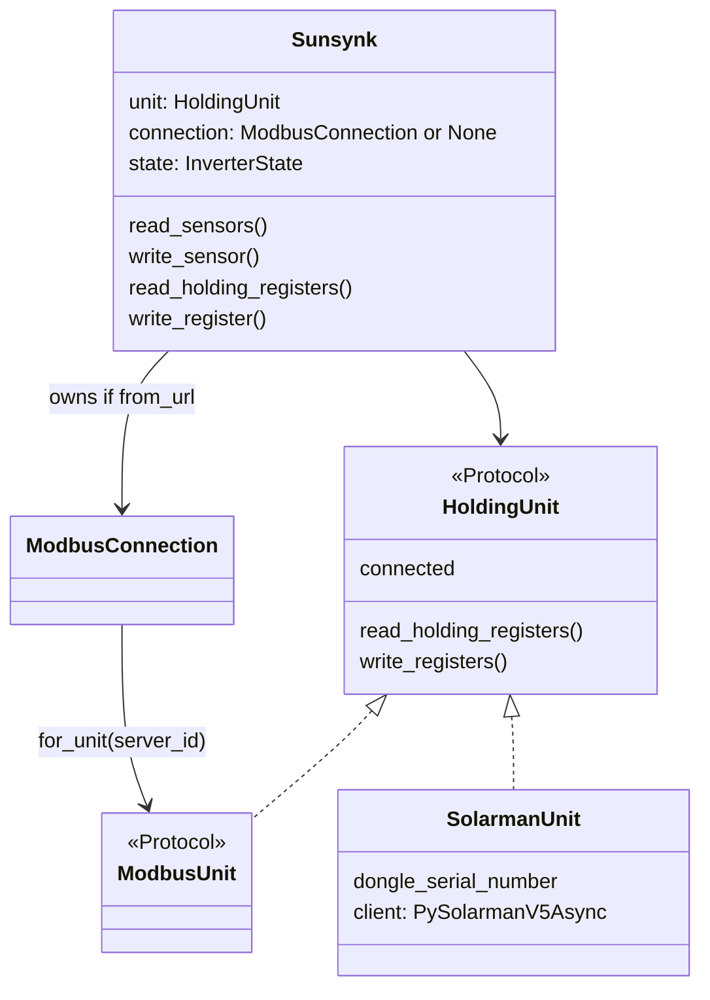

# ModbusUnit underlay

Architecture (why this cut, modelling mismatch, what stays):
[modbus-connection.md](modbus-connection.md).

Replace pymodbus / modbus-rs drivers with
[modbus-connection](https://home-assistant-libs.github.io/modbus-connection/)
(`tmodbus` backend). One concrete `Sunsynk` talks to a `ModbusUnit`. Solarman is a unit adapter, not
a `Sunsynk` subclass. Delete `PySunsynk` and `RSunsynk` with no compatibility aliases.

Sensor definitions, `InverterState`, `group_sensors`, schedules, and MQTT stay as they are. No
`Component` modelling in this change.

## Class layout

Do **not** keep a driver subclass per backend, and do **not** make the base class wrap
`ModbusConnection` with a Solarman subclass.

`ModbusConnection` is the **owner-held link**. The device library takes a **`ModbusUnit`**
([library pattern](https://home-assistant-libs.github.io/modbus-connection/patterns/library/)).
Solarman is a proprietary V5 tunnel, not Modbus TCP/RTU, so it cannot be a `ModbusConnection`
backend. If `Sunsynk` wrapped a connection, Solarman would have to override every I/O method —
today’s subclass mess.



- **`Sunsynk`** becomes concrete. Holding-register I/O lives next to existing `read_sensors` /
  `write_sensor` / `group_sensors`.
- **`HoldingUnit`**: tiny Protocol of what Sunsynk actually calls (holding-register read/write +
  `connected`). Avoids implementing the full `ModbusUnit` surface on Solarman.
- **No `PySunsynk` / `RSunsynk`.** Delete both modules. tmodbus vs pymodbus is an import of
  `ModbusConnection`, not a Sunsynk type.
- **`SolarmanUnit`** (rename `solarmansunsynk.py` → `solarman.py`): wraps `PySolarmanV5Async`, same
  retries as today. Not a `Sunsynk` subclass.

## `for_unit` is the server id

Yes. `connection.for_unit(id)` is the Modbus **unit id** (also called slave id, device id, or server
id). It is the same value as:

- `Sunsynk.server_id` today
- add-on `MODBUS_ID` / `InverterOptions.modbus_id`
- pymodbus `device_id=`

It is **not** a register address. The unit id selects which inverter on a shared RS-485 bus answers;
the register address is a separate argument on the read.

```python
conn = ModbusConnection(ModbusTcpParams(host="192.168.1.50", port=502))
unit = conn.for_unit(1)  # server_id / MODBUS_ID = 1

ss = Sunsynk(unit=unit)
# or: ss = Sunsynk.from_url("tcp://192.168.1.50:502", server_id=1)
```

Two inverters on one adapter: one connection, two units.

```python
conn = open_connection("tcp://192.168.1.50:502")
inv1 = Sunsynk(unit=conn.for_unit(1))
inv2 = Sunsynk(unit=conn.for_unit(2))
```

## Reading an arbitrary holding-register block

`read_holding_registers(address, count)` is FC03: start at any register, read `count` consecutive
16-bit words. That is already what `group_sensors` issues today (`start=grp[0]`, `length=glen`).

```python
# Raw unit: inverter power at 175, then 3 registers (175, 176, 177)
regs = await unit.read_holding_registers(175, 3)
# regs == [175_val, 176_val, 177_val]

# Same call on Sunsynk (timeouts / error wrapping)
regs = await ss.read_holding_registers(175, 3)

# Write one register with FC16 (Sunsynk does not use FC06)
await unit.write_registers(430, [1])
await ss.write_register(address=430, value=1)
```

`read_sensors()` keeps using this: it groups selected `Sensor` addresses, then calls
`read_holding_registers(start, length)` per group. The unit layer does not need to know about
sensors.

## Construction

```python
# Standalone / current port API — Sunsynk owns the connection
ss = Sunsynk.from_url("tcp://host:502", server_id=1, timeout=10)
# ss.connection is owned; ss.unit = connection.for_unit(1)

# Injected unit (tests, multi-inverter, solarman)
ss = Sunsynk(unit=conn.for_unit(1))
ss = Sunsynk(unit=SolarmanUnit(host, port, dongle_serial_number, server_id=1))
```

`from_url` parses the existing schemes:

- `tcp://host:502` → `ModbusTcpParams` (native Modbus TCP)
- `serial-tcp://host:port` → `ModbusTcpParams(..., framer="rtu")`
- `udp://host:port` → `ModbusUdpParams`
- `/dev/ttyUSB0` (or any path with no scheme) → `ModbusSerialParams`

Backend: **`modbus_connection.tmodbus.ModbusConnection`** (serial RTU is why `modbusrs` existed).
`serial-udp` (RTU-over-UDP) is not supported by tmodbus — raise a clear `NotImplementedError`.

Writes stay FC16: `unit.write_registers(address, [value])`.

## Why not a parallel v2 / Component rewrite

`modbus_connection.model` fields are consecutive registers from one start address (`uint32(n)` = `n`
and `n+1`). Sunsynk sensors are not:

- `Sensor16((633, 691), ...)` — two far-apart registers, stateful 16/32-bit heuristic
- `MathSensor((175, 169, 166), factors=(1, 1, -1))` — arbitrary register tuples
- per-tick subset polling (`read_every`) vs `Component.async_update()` of a whole sub-system
- `InverterState` history / averaging / `onchange` for MQTT

Packed bits (`bitmask=`) would map well onto `bit` / `bits`. Leave that for a later optional pass
under the same package, not a second library.

## Library files

- [`src/sunsynk/sunsynk.py`](../src/sunsynk/sunsynk.py): implement `connect` /
  `read_holding_registers` / `write_register` on the unit; map `ModbusTimeoutError` to the current
  timeout counting; keep FC16.
- New [`src/sunsynk/connection.py`](../src/sunsynk/connection.py): `url_to_params(port, baudrate)`
  and `open_connection(...)`.
- New `SolarmanUnit`; **delete** [`src/sunsynk/rsunsynk.py`](../src/sunsynk/rsunsynk.py) and
  [`src/sunsynk/pysunsynk.py`](../src/sunsynk/pysunsynk.py) (no alias).
- [`pyproject.toml`](../pyproject.toml): `modbus-connection[tmodbus]>=4.7.0`; drop
  `pymodbus[serial]==3.11.4` and `optional-dependencies.modbusrs`. Keep `solarman` extra.

Tests: rewrite
[`src/tests/sunsynk/test_pysunsynk.py`](../src/tests/sunsynk/test_pysunsynk.py)
(rename to `test_connection.py`) against `from_url` + `modbus_connection.mock.MockModbusConnection`.
Keep
[`src/tests/sunsynk/test_sunsynk.py`](../src/tests/sunsynk/test_sunsynk.py)
patching `read_holding_registers` / `write_register` on a `Sunsynk` with a mock unit. Delete
[`src/tests/ha_addon_sunsynk_multi/test_modbusrs.py`](../src/tests/ha_addon_sunsynk_multi/test_modbusrs.py).

## Add-on

Bound `for_unit(id)` cannot share one `Sunsynk` and mutate `server_id`. Change the connector from
`(Sunsynk, Lock)` keyed by `(port, driver)` to:

- **Modbus:** one `ModbusConnection` per port; each `AInverter` gets its own
  `Sunsynk(unit=conn.for_unit(modbus_id), state=ist.state)`.
- **Solarman:** one `SolarmanUnit` + `Sunsynk` per inverter (sharing stays untested).

Drop `server_id` mutation in `lock_io`. Connection already serializes frames, so the `asyncio.Lock`
can go. `connect()` on the shared connection (or solarman unit) stays.

[`src/ha_addon_sunsynk_multi/driver.py`](../src/ha_addon_sunsynk_multi/driver.py):
`pymodbus` → `Sunsynk.from_url`; `solarman` → `SolarmanUnit`. Drop `modbusrs` from the factory and
from edge/multi schema (`pymodbus|solarman` only). No remap alias — leftover `DRIVER: modbusrs`
fails with a message to use `pymodbus`.

[`src/ha_addon_sunsynk_multi/options.py`](../src/ha_addon_sunsynk_multi/options.py):
remove the “use mbusd or modbusrs for serial” warning — tmodbus serial is first-class.

[`hass-addon-sunsynk-edge/Dockerfile`](../hass-addon-sunsynk-edge/Dockerfile):
install `./sunsynk[solarman]` only; delete rustup / `.build-deps` used only for `modbus-rs`.

## User-facing docs (implementation)

Update DRIVER notes in `www/docs/reference/multi-options.md`, `www/docs/guide/fault-finding.md`,
`www/docs/guide/standalone-deployment.md`, and edge translations/CHANGELOG: default driver is
pymodbus (tmodbus under the hood); direct serial works; `modbusrs` is gone.

## Out of scope

`modbus_connection.model.Component`, rewriting definitions, generating Sensors from fields.
