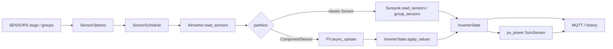

# PV sensors via Component

Status: **proposed** (alternative: [`pv_dynamic_total.md`](pv_dynamic_total.md))

## Overview

Introduce per-profile PV Components as the Modbus read path, keep existing sensor slugs as the
config/HA surface, remove PVx from `power_flow_card`, and replace register-based `pv_power` with a
sum of the user’s selected `pvN_power` sensors.

## Context

Today only [`Identity`](../src/sunsynk/identity.py) uses `modbus_connection.model.Component`
(one-shot regs 0–7). All PV readings still go through `Sensor` + `group_sensors` + `InverterState`.
Docs already describe the intended later step:
**Component owns the register layout; `Sensor` stays the HA/mysensors view**
([`modbus-connection.md`](modbus-connection.md) “If Components come later”).

**Component package:** all Components live under
[`src/sunsynk/components/`](../src/sunsynk/components/). Move
[`identity.py`](../src/sunsynk/identity.py) →
[`src/sunsynk/components/identity.py`](../src/sunsynk/components/identity.py). Re-export from
`sunsynk.components` (and optionally keep `sunsynk.identity` as a thin shim for backwards compat).
Update imports in `a_inverter.py`, tests, and docs.

PV fits that spike better than Battery: small blocks, read-only, same slugs users already know
(`pv1_power`, …).

**Layout note (why not one Component per MPPT):** on 1PH, V/I live at 109–114 and power at 186–188
(gap ≫ `max_gap=16`), so a per-channel Component would still split reads. One Component per
**register map family** is the natural shape; the planner issues 1–2 FC03 blocks automatically.

**3PH LV + HV as one class:** `PVThreePhase` declares PV1–4 V/I, PV1–8 power (all register
addresses). Differences between profiles are handled outside the Component class:

| Concern       | 3PH LV                                          | 3PH HV                        |
| ------------- | ----------------------------------------------- | ----------------------------- |
| MPPT count    | pv1–4 sensors in definitions                    | pv1–8 sensors in definitions  |
| PV5–8 fields  | never tracked → `restrict_fields` excludes them | included when selected        |
| Power scaling | `ComponentSensor` factor `-1` (signed)          | `ComponentSensor` factor `10` |

Power fields on the Component read **raw register words** (`integer(addr, signed=False)`); the
bridge applies each sensor’s existing `factor` (same signed/unsigned rules as today’s `Sensor`). V/I
use `gauge(..., 0.1)` — identical on both profiles. No second HV class needed.

## Selective reads and totals

**A single PV Component still reads only what the user configured.** The class declares the full
register layout; at runtime we narrow it with `Component.restrict_fields()`.

When sensor selection is resolved (`init_sensors` / track):

1. Collect the Component field names needed for **tracked** PV sensors (e.g. user enabled
   `pv1_power` + `pv1_voltage` → fields `pv1_power`, `pv1_voltage` only).
2. If `pv_power` is enabled, also include every `pvN_power` field that contributes to the total (see
   below).
3. Call `restrict_fields(...)` on the PV instance (recreate the instance if already restricted).
4. Each poll calls `async_update()` on that narrowed component → Modbus reads **only** those
   registers.

**Unconfigured sensors:**

| Concern          | Behaviour                                                  |
| ---------------- | ---------------------------------------------------------- |
| Modbus read      | Not read — field excluded by `restrict_fields`             |
| HA entity        | Not created — never tracked                                |
| `pv_power` total | **Not included** — only selected `pvN_power` sensors count |

**`pv_power` sum rules:**

- User enables `pv1_power` + `pv2_power` + `pv_power` → total = pv1 + pv2 only.
- User enables `pv_power` alone → auto-track all profile `pvN_power` as **hidden** deps (polled, no
  HA entity); total = sum of all MPPTs for that profile.
- User enables `pv1_voltage` only → no `pv_power`, no power fields read.

The Component class is **not** config-aware — it is the layout map. Selection + `restrict_fields` +
`SumSensor.sources` keep reads and totals aligned with config.

**Update cadence:** unchanged from today. Schedules/MQTT are not touched. Power (`W`) sensors read
every 5s, report every 60s (or ≥80 W change); V/I read every 15s.



## Design decisions

1. **Config/HA unchanged in shape** — users still list slugs (`pv1_power`, `pv2_voltage`, …) and can
   still put those slugs in groups.
2. **Read path changes for PV only** — selected PV sensors are satisfied by
   `Component.async_update()`, not by `group_sensors`.
3. **Remove all `pv*` live power/V/I from `power_flow_card`** (including `pv_power`). Keep
   `day_pv_energy` / `total_pv_energy` where they already are. Users who need PV must list slugs
   explicitly (update edge defaults accordingly).
4. **`pv_power` becomes a value-sum, not a register `MathSensor`:** sum of enabled `pvN_power`
   sensors. If the user enables `pv_power` alone, auto-track every profile `pvN_power` as **hidden**
   deps (polled, no HA entity) so the total still works.
5. **No hand-edits under `hass-addon-sunsynk-multi/`** — edge + `src/` + docs only.

## Implementation

### A. Component package + PV layouts

```text
src/sunsynk/components/
  __init__.py      # re-export Identity, pv_component_for, …
  identity.py      # moved from src/sunsynk/identity.py
  pv.py            # PVSinglePhase, PVThreePhase
```

- **`PVSinglePhase`** — pv1–3 power (186–188), V/I (109–114). Used by `single-phase` and
  `single-phase-16kw`.
- **`PVThreePhase`** — pv1–4 V/I (676–683), pv1–8 power (672–675, 727–730). Used by both
  `three-phase` and `three-phase-hv`.

Factory: `pv_component_for(defs_name) -> type[Component]` returns `PVSinglePhase` or `PVThreePhase`.

```python
# three_phase_common.py
SENSORS += pv_sensors(PVThreePhase, mppts=4, power_factor=-1)

# three_phase_hv.py — same Component, more MPPTs + HV scale
SENSORS += pv_sensors(PVThreePhase, mppts=8, power_factor=10)
```

Helper: `fields_for_sensors(tracked_pv_sensors) -> set[str]` — maps `ComponentSensor` instances to
field names for `restrict_fields`.

### B. Thin sensors from Component fields

- `ComponentSensor` subclass tagged with `field="pv1_power"` etc.
- `pv_sensors()` generates sensors + `SumSensor("PV power")` per profile.
- `SumSensor`: no Modbus; value = sum of tracked `pvN_power` in `InverterState`.

### C. Read bridge

In `AInverter.read_sensors`:

1. Partition `component_backed` vs `classic`.
2. Classic → existing `inv.read_sensors`.
3. PV → `restrict_fields` + `async_update` + `InverterState.apply_values`.
4. Evaluate `SumSensor`s in the same tick.

Instantiate `self.pv` at connect (alongside `read_identity`).

### D. Groups + defaults + docs

- Strip `pv_power` and all `pvN_*` from `power_flow_card` in edge `sensor_options.py`.
- Edge `config.yaml`: explicit starter PV slugs after `power_flow_card`.
- CHANGELOG: breaking — PV no longer implied by `power_flow_card`.

### E. Tests

- Component decode (1PH + 3PH, LV signed vs HV ×10).
- Bridge read for selected sensors only.
- `pv_power` sum selection rules.

## Out of scope

- Battery/Grid Component migration.
- Rewrite of `group_sensors` / schedules / MQTT.
- Edits under `hass-addon-sunsynk-multi/`.
- Energy counters (`day_pv_energy`, `total_pv_energy`) — stay classic sensors.

## Success criteria

- `pv1_power` HA entity unchanged; value from `PV*.async_update()`.
- `power_flow_card` alone does not enable any `pvN_*` / `pv_power`.
- `pv_power` equals sum of user’s enabled `pvN_power` sensors.
- Non-PV sensors and Identity path unchanged.

## Tasks

- [ ] Add `src/sunsynk/components/`; move `identity.py`; add `PVSinglePhase` + `PVThreePhase`
- [ ] `ComponentSensor` + `pv_sensors()`; replace PV blocks in definitions; `SumSensor`
- [ ] Read bridge in `AInverter`; `InverterState.apply_values`
- [ ] Groups, edge defaults, docs, CHANGELOG
- [ ] Tests
