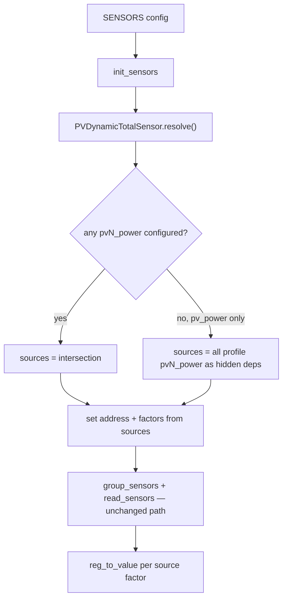

# PV dynamic total (`pv_power`)

Status: **implemented** (alternative: [`pv_component.md`](pv_component.md))

## Overview

Smaller change than the Component migration: keep `pv1_power`, `pv2_power`, … as classic `Sensor`
definitions. Replace the fixed-register `MathSensor` for `pv_power` with a new sensor class that
**at runtime** builds its register list and factors from whichever `pvN_power` sensors are tracked.
Add `pv_power` to single-phase (today 1PH has no aggregate).

Also remove PVx from `power_flow_card` so users enable MPPTs explicitly.

## Problem today

[`three_phase_common.py`](../src/sunsynk/definitions/three_phase_common.py) hard-codes all four MPPT
power registers regardless of config:

```python
MathSensor(
    (672, 673, 674, 675), "PV power", WATT, factors=(1, 1, 1, 1)
),  # pv1,pv2,pv3,pv4 power
```

HV does the same with eight registers. Single-phase has **no** `pv_power` at all. Enabling
`pv_power` always reads/sums every register in the tuple, even if the user only cares about PV1+PV2.

## Approach

Introduce **`PVDynamicTotalSensor`** (name TBD — `DynamicMathSensor` also fine) in
[`sensors.py`](../src/sunsynk/sensors.py):

```python
@dataclass(slots=True, eq=False)
class PVDynamicTotalSensor(Sensor):
    """PV total: sum registers from configured pvN_power sources."""

    source_ids: tuple[str, ...]  # ("pv1_power", "pv2_power", …) for this profile
    sources: tuple[Sensor, ...] = field(init=False, default=())
    factors: tuple[float, ...] = field(init=False, default=())
```

### Resolution (config-aware, at `init_sensors`)

After the user’s sensor list is known, call `resolve(configured: set[Sensor])`:

1. **Intersection:** `configured_sources` = profile `source_ids` whose `Sensor` is already in
   `SensorOptions` (visible or hidden).
2. **If any configured_sources** (user enabled some `pvN_power` ± `pv_power`):
   - `sources` = those sensors only.
   - `address` = flattened register tuple from each source (each `pvN_power` is one register).
   - `factors` = each source’s `factor` (preserves LV signed `-1` vs HV `×10`).
3. **If none** (user enabled **`pv_power` only**):
   - `sources` = all profile `source_ids` from `DEFS.all`.
   - Auto-add them as **hidden** tracked sensors (same pattern as `RWSensor.dependencies` in
     [`sensor_options.py`](../src/ha_addon_sunsynk_multi/sensor_options.py)).
4. If `pv_power` is not configured at all → sensor never tracked; no reads.

`resolve()` mutates `address` / `factors` / `sources` on the single definition instance (same
`Sensor` object in `DEFS.all`, like overrides).

Hook: extend `SensorOptions.init_sensors()` — after building `sensors_all` / `sensors_1st`, run
`resolve()` on every `PVDynamicTotalSensor` in the selection before `_add_sensor` / deps loop, or
add a `dependencies` property that returns unresolved sources and a second pass that trims to
configured subset.

Prefer **explicit `resolve()` pass** so intersection logic is clear.

### Decode

Do **not** reuse `MathSensor.reg_to_value` (it always `signed=True`). Decode each register with its
**source sensor’s** rules:

```python
def reg_to_value(self, regs: RegType) -> ValType:
    return int_round(
        sum(
            src.reg_to_value((reg,))
            for src, reg in zip(self.sources, regs, strict=True)
        )
    )
```

This matches individual `pvN_power` scaling on HV and LV.

### Definitions

One shared sensor on [`COMMON`](../src/sunsynk/definitions/__init__.py):

```python
COMMON += PVDynamicTotalSensor(0, "PV power", WATT)
# source_ids default: pv1_power … pv8_power
```

Every profile copies `COMMON`, so 1PH / 16kW / 3PH LV / HV all get the same slug. `resolve()` keeps
only ids that exist in that profile’s `DEFS.all` — 1PH never sees pv4–8, LV never sees pv5–8.

Individual `Sensor(186, "PV1 power", …)` blocks stay unchanged.

### Individual `pvN_power` sensors — stay in definitions (explicit)

**Yes — each profile still declares its own `pvN_power` (and V/I) sensors.** The shared
`PVDynamicTotalSensor` does not generate them; it looks them up by slug and **silently skips** any
id the profile never defined.

| Profile             | File                                                                        | Individual sensors                                          | Notes                                                                     |
| ------------------- | --------------------------------------------------------------------------- | ----------------------------------------------------------- | ------------------------------------------------------------------------- |
| `single-phase`      | [`single_phase.py`](../src/sunsynk/definitions/single_phase.py)             | `pv1`–`pv3` power + V/I                                     | Unchanged blocks (~L94–116)                                               |
| `single-phase-16kw` | [`single_phase_16kw.py`](../src/sunsynk/definitions/single_phase_16kw.py)   | Same as 1PH (copy)                                          | Inherits PV sensors from `single_phase`                                   |
| `three-phase`       | [`three_phase_common.py`](../src/sunsynk/definitions/three_phase_common.py) | `pv1`–`pv4` power + V/I                                     | No local `pv_power`                                                       |
| `three-phase-hv`    | [`three_phase_hv.py`](../src/sunsynk/definitions/three_phase_hv.py)         | Overrides `pv1`–`pv4` power (`×10`); adds `pv5`–`pv8` power | Same shared `pv_power`; extra MPPTs appear in defs so they join the total |

**What stays per file:** per-MPPT `Sensor(...)` entries — register addresses and factors differ by
profile (1PH 186–188 vs 3PH 672–675, LV signed vs HV `×10`).

**Not in scope for this plan:** generating `pvN_power` from a shared table or Component — that is
[`pv_component.md`](pv_component.md) (`pv_sensors()` from `PVThreePhase`).



## Shared with Component plan

- Remove `pv_power`, `pv1_power`, … from `power_flow_card` (edge `sensor_options.py`).
- Edge `config.yaml`: list explicit PV slugs in defaults.
- CHANGELOG breaking note.

## What this does **not** do

- No `modbus_connection` Component for PV reads.
- No `ComponentSensor` / `restrict_fields` bridge.
- No move of `identity.py` (can still happen separately).
- `pv1_voltage` / `pvN_current` stay plain `Sensor` — only the **total** is dynamic.

## Comparison

|                                 | `pv_dynamic_total`                         | `pv_component`                                  |
| ------------------------------- | ------------------------------------------ | ----------------------------------------------- |
| Diff size                       | Small (~1 sensor class + init hook + defs) | Large (components package, bridge, SumSensor)   |
| PV read path                    | `group_sensors` (today)                    | `Component.async_update`                        |
| Register layout                 | Still in definitions per `pvN_power`       | Centralised in `PVThreePhase` / `PVSinglePhase` |
| `pv_power`                      | Dynamic register `MathSensor`              | Value-sum after component read                  |
| Extends to PV V/I via Component | No                                         | Yes                                             |
| 1PH `pv_power`                  | Yes                                        | Yes                                             |

**When to pick this:** you want configurable `pv_power` and explicit MPPT selection **now**, without
committing to the Component migration. Component plan remains the path for deduplicating register
maps and reading PV blocks through `modbus_connection`.

## Tests

- `resolve()`: pv1+pv2+pv_power → address `(186, 187)` on 1PH; factors `(-1, -1)`.
- `resolve()`: pv_power only → all three 1PH sources added hidden; address `(186, 187, 188)`.
- `reg_to_value`: HV sources with factor `10` decode like individual sensors.
- `init_sensors` integration: hidden deps logged; `group_sensors` batch only includes resolved regs.

## Success criteria

- Enabling only `pv1_power` + `pv_power` on 3PH does not read regs 673–675.
- `pv_power` alone sums all profile MPPTs (with hidden `pvN_power` polls).
- Single-phase users can enable `pv_power` and get PV1+2+3 total.
- `power_flow_card` no longer implies PV sensors.

## Tasks

- [x] Add `PVDynamicTotalSensor` + `resolve()` in `sensors.py`
- [x] Hook `resolve()` in edge `SensorOptions.init_sensors()`
- [x] One `pv_power` on `COMMON` (`pv1`–`pv8`); skip missing per profile
- [x] Remove PVx from `power_flow_card`; edge defaults; CHANGELOG
- [x] Tests for resolve, decode, and init_sensors deps
