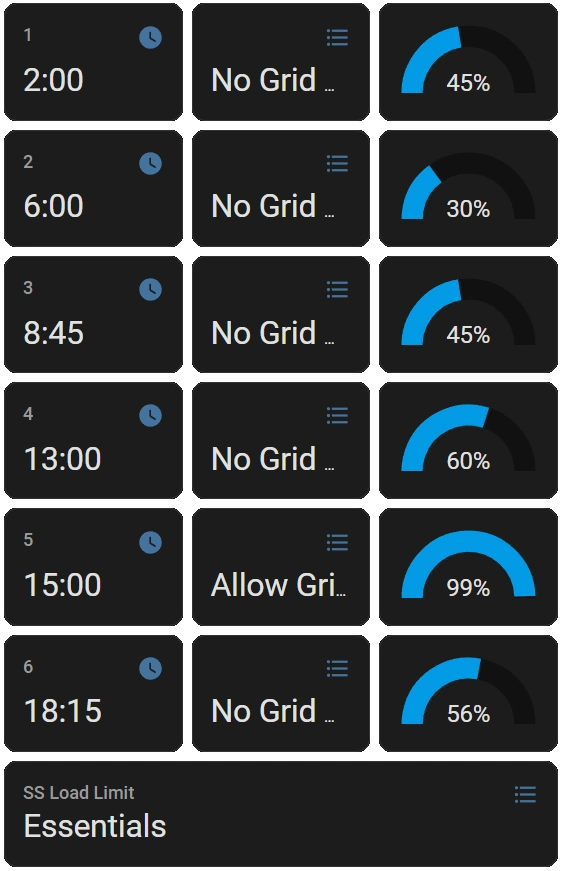

# System settings card

Below you can find two examples Lovelace cards to show, and allow editing, of the System mode in the frontend

## Example #1

This card shows the system values and can be edited by clicking on individual settings.



::: details Required sensors
The following sensors are required in the addon configuration.

```yaml
SENSORS:
  - load_limit
  - prog1_capacity
  - prog1_charge
  - prog1_time
  - prog2_capacity
  - prog2_charge
  - prog2_time
  - prog3_capacity
  - prog3_charge
  - prog3_time
  - prog4_capacity
  - prog4_charge
  - prog4_time
  - prog5_capacity
  - prog5_charge
  - prog5_time
  - prog6_capacity
  - prog6_charge
  - prog6_time
```
:::


::: details Lovelace yaml
```yaml
type: vertical-stack
cards:
  - type: horizontal-stack
    cards:
      - type: entity
        entity: select.ss_prog1_time
        name: '1'
      - type: entity
        entity: select.ss_prog1_charge
        name: ' '
        state_color: false
      - type: gauge
        entity: number.ss_prog1_capacity
        needle: false
        name: ' '
  - type: horizontal-stack
    cards:
      - type: entity
        entity: select.ss_prog2_time
        name: '2'
      - type: entity
        entity: select.ss_prog2_charge
        name: ' '
        state_color: false
      - type: gauge
        entity: number.ss_prog2_capacity
        needle: false
        name: ' '
  - type: horizontal-stack
    cards:
      - type: entity
        entity: select.ss_prog3_time
        name: '3'
      - type: entity
        entity: select.ss_prog3_charge
        name: ' '
        state_color: false
      - type: gauge
        entity: number.ss_prog3_capacity
        needle: false
        name: ' '
  - type: horizontal-stack
    cards:
      - type: entity
        entity: select.ss_prog4_time
        name: '4'
      - type: entity
        entity: select.ss_prog4_charge
        name: ' '
        state_color: false
      - type: gauge
        entity: number.ss_prog4_capacity
        needle: false
        name: ' '
  - type: horizontal-stack
    cards:
      - type: entity
        entity: select.ss_prog5_time
        name: '5'
      - type: entity
        entity: select.ss_prog5_charge
        name: ' '
        state_color: false
      - type: gauge
        entity: number.ss_prog5_capacity
        needle: false
        name: ' '
  - type: horizontal-stack
    cards:
      - type: entity
        entity: select.ss_prog6_time
        name: '6'
      - type: entity
        entity: select.ss_prog6_charge
        name: ' '
        state_color: false
      - type: gauge
        entity: number.ss_prog6_capacity
        needle: false
        name: ' '
```
:::


## Example #2

Another example of a panel to control the Turbo Energy inverter system work mode from Home Assistant

This panel is editable directly from the frontend and includes sensors `prog1_mode`...`prog6_mode`

::: details Lovelace yaml
```yaml
  - theme: Backend-selected
    title: Bateria
    path: bateria
    icon: mdi:battery
    badges: []
    cards:
      - type: entities
        entities:
          - entity: select.prog1_time
            name: Hora
          - entity: number.prog1_power
            name: Potencia maxima
          - entity: select.prog1_mode
            name: Modo
          - entity: number.prog1_capacity
            name: Minimo Bateria
        title: Horario 1
      - type: entities
        entities:
          - entity: select.prog2_time
            name: Hora
          - entity: number.prog2_power
            name: Potencia maxima
          - entity: select.prog2_mode
            name: Modo
          - entity: number.prog2_capacity
            name: Minimo Bateria
        title: Horario 2
      - type: entities
        entities:
          - entity: select.prog3_time
            name: Hora
          - entity: number.prog3_power
            name: Potencia maxima
          - entity: select.prog3_mode
            name: Modo
          - entity: number.prog3_capacity
            name: Minimo Bateria
        title: Horario 3
      - type: entities
        entities:
          - entity: select.prog4_time
            name: Hora
          - entity: number.prog4_power
            name: Potencia maxima
          - entity: select.prog4_mode
            name: Modo
          - entity: number.prog4_capacity
            name: Minimo Bateria
        title: Horario 4
      - type: entities
        entities:
          - entity: select.prog5_time
            name: Hora
          - entity: number.prog5_power
            name: Potencia maxima
          - entity: select.prog5_mode
            name: Modo
          - entity: number.prog5_capacity
            name: Minimo Bateria
        title: Horario 5
      - type: entities
        entities:
          - entity: select.prog6_time
            name: Hora
          - entity: number.prog6_power
            name: Potencia maxima
          - entity: select.prog6_mode
            name: Modo
          - entity: number.prog6_capacity
            name: Minimo Bateria
        title: Horario 6
```
:::
