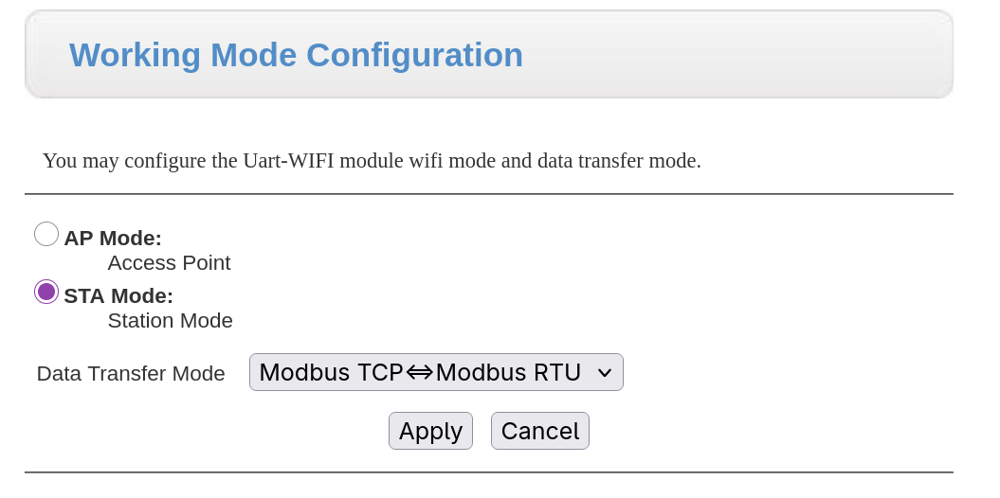
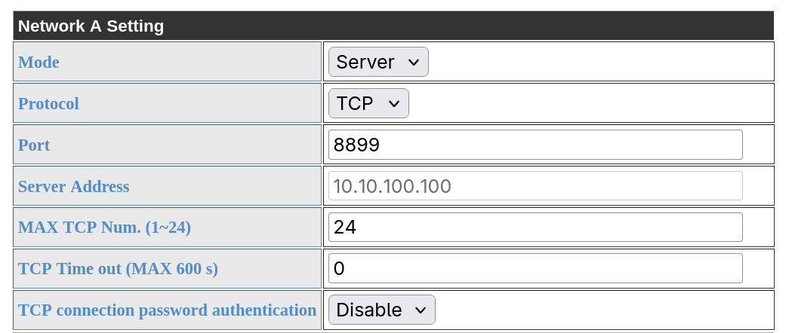
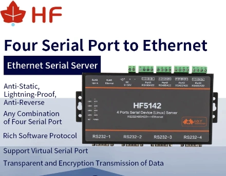
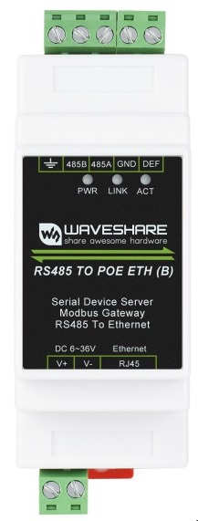

# Adaptors & Wiring

## RS485 wiring

### Dedicated port

RS485 requires a twisted pair, this works with CAT5 network cable and RJ-45 connectors.

If the RJ-45 connector on the inverter side is crimped according to [T568A/T568B](https://en.wikipedia.org/wiki/ANSI/TIA-568#Wiring), you can use the pinout in the following table. If the two outermost colors you see on the connector are brown and green, it is probably T568A; if they are brown and orange, it is probably T568B.

| RJ45 Pin (inverter side)   | Wire Color (T568A) | Wire Color (T568B) | RS485 pins  |
|:-----------------------------:|:------------------:|:------------------:|:-----------:|
|               1               |    Green-White     |    Orange-White    |    B/D-     |
|               2               |       Green        |       Orange       |    A/D+     |
|               3               |    Orange-White    |    Green-White     |     GND     |

### Combined RS485/CAN port ("2-in-1" BMS port)

On many newer Sunsynk and Deye hybrid inverters, the **BMS** RJ45 socket is a single physical connector that carries **two independent buses**:

- **Pins 1–3** — Modbus RTU over **RS485** (same mapping as the table above). This is what the add-on uses when you wire an RS485 adaptor or Ethernet gateway to that port.
- **Pins 4–5** — **CAN** high and low between the inverter and a compatible lithium battery BMS.

Because RS485 and CAN use different pairs, the inverter can talk to the battery on CAN while you attach a monitor on RS485 **if** both branches are wired correctly.

**If the battery already uses this port**

You cannot simply unplug the battery cable and leave the battery unmanaged. You need either:

- A **passive RJ45 splitter** (one plug into the inverter, two sockets): one lead to the battery with **only** the pins the battery needs (usually CAN on 4–5, plus GND if required by that cable), and one lead to your RS485 device with **only** pins 1–3 (and no accidental connection of RS485 into the battery end), or  
- A **custom Y cable** built to the same rule: inverter → battery path preserves CAN; inverter → adaptor path is **only** the RS485 pair and reference ground.

**Why that matters**

If a homemade splitter or patch cable feeds **all eight pins** to both the battery and an RS485 adaptor, RS485 signals can appear on pins at the battery that were not designed for them, which can disrupt BMS communication or monitoring. The battery leg should not carry RS485 A/B unless the battery documentation explicitly says so.

**Pin reference (inverter RJ45, typical 2-in-1 BMS port)**

| RJ45 pin | Wire Color (T568A) | Wire Color (T568B) | Typical signal | Notes                      |
| :------: | :----------------: | :----------------: | -------------- | -------------------------- |
|    1     |    Green-White     |    Orange-White    | RS485 B (D−)   | Same as the dedicated port |
|    2     |       Green        |       Orange       | RS485 A (D+)   | Same as the dedicated port |
|    3     |    Orange-White    |    Green-White     | GND            | Same as the dedicated port |
|    4     |        Blue        |        Blue        | CAN high       | Battery BMS                |
|    5     |     Blue-White     |     Blue-White     | CAN low        | Battery BMS                |
|    6     |       Orange       |       Green        | Often unused   |                            |
|    7     |    Brown-White     |    Brown-White     | Often unused   |                            |
|    8     |       Brown        |       Brown        | Often unused   |                            |

Exact pin use can vary by model and firmware; always check the BMS / communications section of your inverter manual before building or buying a splitter.

### DB9 / dongle port

Many Sunsynk/Deye inverters expose their Modbus interface on a **DB9** connector - the same port used by the Sunsynk/Solarman WiFi data logger. The inverter communicates **Modbus RTU over RS485** on this port (the data lines are RS485 differential, **not** RS232), and the port also supplies a DC voltage to power the dongle.

The pinout below is described **from the inverter's DB9 port**:

| DB9 Pin | Inverter signal       | Connect to (RS485) |
| :-----: | --------------------- | :----------------: |
|    1    | RS485 **B** (D-)      |        B/D-        |
|    2    | RS485 **A** (D+)      |        A/D+        |
|    3    | NC (not connected)    |         -          |
|    4    | DC power out          |         -          |
|    5    | GND                   |        GND         |

::: warning

- The data lines are **RS485** (differential A/B), not RS232. Connect to an **RS485** adaptor/gateway: pin 2 → A/D+, pin 1 → B/D-, pin 5 → GND.
- **Pin 4 supplies DC power out** to feed the dongle. The output voltage is model-dependent - **measure it before use** (the Solarman LSW-3 logger accepts DC 5-12V).
- You must **remove the dongle/stick logger** while using this port - it is the same single bus and only a single master should poll the inverter.
- Settings are unchanged: 9600 baud, 8N1, Modbus RTU.

:::

## USB-to-RS485 adaptors

1. Waveshare USB-to-RS485 [example](https://www.robotics.org.za/W17286)

   This is my preferred adaptor. It includes a GND and lightning/ESD protection, TVS diodes and a resettable fuse.

   

   Waveshare also has a RS485-to-Ethernet module.

2. USB-to-RS485 adaptor with cable [example](https://www.robotics.org.za/index.php?route=product/product&product_id=5947)

   Includes a GND and TVS diode and USB self recovery options.

   

Other tested adaptors

- USB-to-RS485 3 Pin adaptor [example](https://www.robotics.org.za/RS485-3P)

  Includes a GND and TVS diode and USB self recovery options.

- 2-Wire USB-to-RS485 [example](https://www.robotics.org.za/RS485-MINI)

  This is the adaptor I started with. It works, but does not include a GND, so your success might vary.
  

## Ethernet-to-RS485 gateways

1. USR-W630 Wifi-to-RS485

   This is a tested Wifi-to-RS485 gateway, which also includes a GND.

   Requires `READ_SENSORS_BATCH_SIZE` set to 8 or less

   A 120 Ohm (brown-red-brown) resistor may be required for data communication between the adapter and inveter to occur without corruption. The resistor should be added between the A+B lines, such as in the example below.

   > NOTE: The resistor legs should be trimmed to a more reasonable length to ensure they don't accidentally short together.

   

   ### USR-W630 Configuration (Wi-Fi)

   1. Connect the USR-W630 to your home network using the STA Interface Settings.
   2. Set Working Mode Configuration to `Modbus TCP<=>Modbus RTU`:
   
   3. Ensure "Modbus Polling" is disabled:
   
   4. The add-on connects to `tcp://<server>:<port>`
      - The server address of the USR-W630 was obtained through DHCP. You can allocate a fixed IP on your router's DHCP settings.
   
   
      - This port is used in the addon configuration when adding the inverter connection.
      - The server address of the USR-W630 is determined when the network connection was established, the greyed out value here is irrelevant.

2. USR-W610 Wifi-to-RS485

   This is a tested Wifi-to-RS485 gateway. Usually significantly cheaper than the W630, however it does not include a GND.

   Requires `READ_SENSORS_BATCH_SIZE` set to 8 or less

3. HF5142B  Modbus/serial to ethernet (4x RS232/485/422 to 4x E-Ports)

   

   This gateway was tested with the Deye 8k EU Hybrid inverter. The following serial settings were used:

   

4. Waveshare RS485 TO (POE) ETH  (1x RS485 to 1x E-Port)

   [Waveshare wiki: RS232/485/422 TO POE ETH (B)](https://www.waveshare.com/wiki/RS232/485/422_TO_POE_ETH_(B))

   

   This gateway was tested with the Deye 3 Phase Hybrid Inverter SUN-25K-SG01HP3-EU-AM2. The following serial settings were used:

   

## Sunsynk Inverters

### Sunsynk 3.6kW Inverter

### Sunsynk Ecco 3.6kW Hybrid Inverter

Model number: `SUN-3.6K-SG04LP1-EU`

This likely applies to similar models in the Ecco range: `SUN-3K-SG04LP1-24-EU / SUN-3K-SG04LP1-EU / SUN-5K-SG04LP1-EU / SUN-6K-SG04LP1-EU`

[Closer view of the RS485/CAN port](../images/inv-ss-ecco-3-6kw-485can.png)

### Sunsynk 5.5kW Inverter

Tested with: USB-to-RS485 adaptor sourced from Banggood, very similar to [this](https://www.robotics.org.za/RS485-MINI?search=rs485).

NOTE: RJ-45 port marked **RS485** (bottom right) does not work.

### Sunsynk 8.8kW Inverter

Tested with: USB-to-485 adaptor sourced from [Micro Robotics](https://www.robotics.org.za/index.php?route=product/product&product_id=5947)

## Deye Inverters

### Deye 8kW Inverter

RS485 is the blue line - top left, as with the Sunsynk inverters. Yellow is the CAN-comms with the Pylontech batteries

### Deye 25kW HV Inverter

RS485 is the grey line - bottom right. BMS1 is the CAN-comms with the Dyness batteries

## Turbo-Energy Inverter

### Turbo-Energy 5kW Inverter

Tested with: USB-to-RS485 adaptor sourced from Aliexpress, very similar to [this](https://www.robotics.org.za/RS485-3P).
